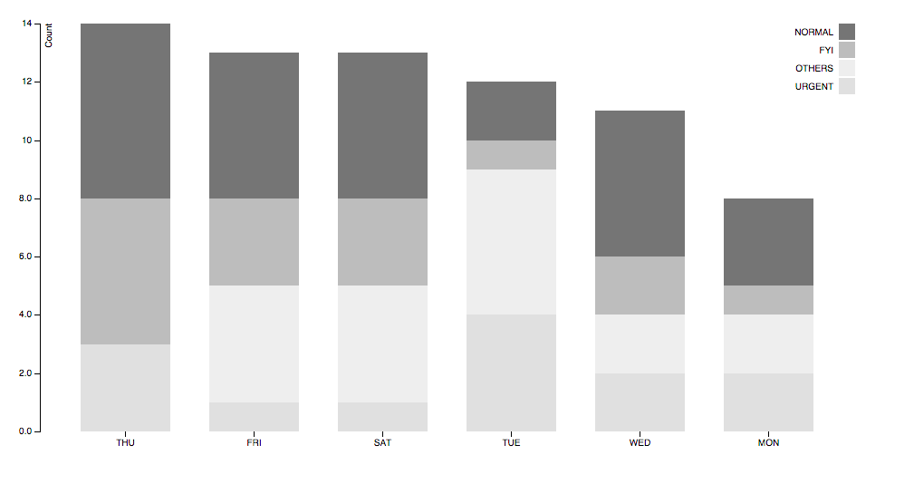

#bar-chart-abinash

a [d3js](d3js.org) stacked bar chart example in response to this [d3js google group question](https://groups.google.com/forum/#!topic/d3-js/sI8DOAvxfjA)

the chart is adapted from this canonical [stacked bar chart](http://bl.ocks.org/mbostock/3886208).  find the code for this one at `\csv-example`

`\data-prep` with the [fs](https://nodejs.org/api/fs.html) and [jsonfile](https://github.com/jprichardson/node-jsonfile) [nodejs](https://nodejs.org/) modules as a well as a vanilla javascript [while loop](https://developer.mozilla.org/en-US/docs/Web/JavaScript/Reference/Statements/while).

